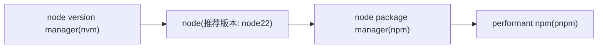

# 湖南大学机器人学院学生手册

一个一站式的学生信息获取据点, 由湖南大学机器人学院`桃子湖工作室`维护.

本仓库中暂时使用`vuepress-theme-hope`构建, 代码部分使用`MIT协议`[@Mr.Hope](https://github.com/Mister-Hope)和`Apache 2.0协议`开源.

投稿文档均使用 CC BY-NC-SA 4.0 协议共享.

欢迎来桃子湖工作室提交文档.

## 构建

使用`pnpm`包管理器.

推荐开发模式:



```bash
$ pnpm install
$ pnpm run dev
```

## Contact联系:
xxxx@hnu.edu.cn

